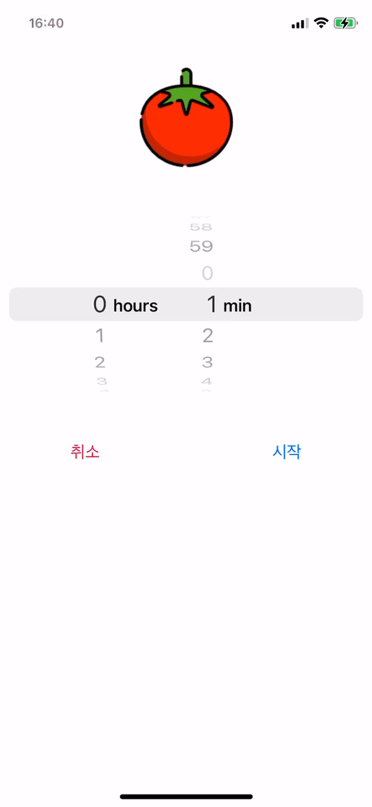
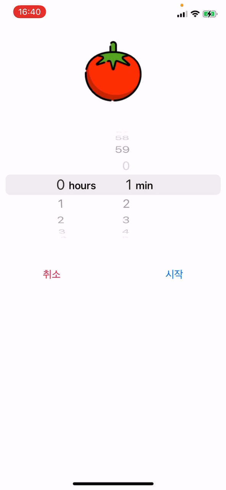
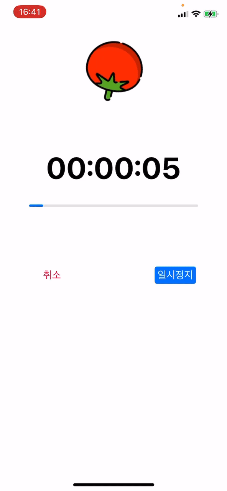

# Pomodoro Timer 앱

## *Introduce*

### Pomodoro 기법?
25분 동안 무언가에 집중하고 5분동안 쉼으로써 집중력을 향상시키는 기법입니다.

주요 기능은 다음과 같습니다.
- 타이머 시작
- 일시정지
- 취소 및 종료


</br>

타이머를 종료할 때는 AudioToolBox 프레임워크를 사용해 알람을 울립니다.
```swift
import AudioToolBox

class ViewController: UIViewController {
    AudioServicesPlaySystemSound(SoundID)
}  
```
SoundID는 다음 <a herf="https://iphonedev.wiki/index.php/AudioServices" target="_blank">iphonedev.wiki</a>에서 확인할 수 있습니다.

</br>

다음은 클로저를 사용한 타이머 설정 및 시작 예제입니다.
```swift
func startTimer() {
        if self.timer == nil{
            self.timer = DispatchSource.makeTimerSource(flags: [], queue: .main)
            self.timer?.schedule(deadline: .now(), repeating: 1)
            self.timer?.setEventHandler(handler: { [weak self] in
                guard let self = self else { return }
                // 타이머 실행 중에 수행해야할 코드 작성
                
                // 타이머의 시간이 다 되었을 경우
                if self.currentSeconds <= 0 {
                    // 타이머 종료 시에 수행해야할 코드 작성
                }
            })
            
            self.timer?.resume()
        }
    }
```

</br>

남은 시간을 나타내기 위해서 ProgressBar를 사용했습니다.
```swift
@IBOutlet weak var progressView: UIProgressView!

progressView.progress = Float(self.currentSeconds) / Float(self.duration)
```


</br>

## *Demo*
<p align="center"><p>
<center>타이머 시작</center>
</br>
<p align="center"><p>
<center>타이머 실행 중 일시정지 -> 재시작</center>
</br>
<p align="center"><p>
<center>타이머 종료 (소리 알람)</center>
